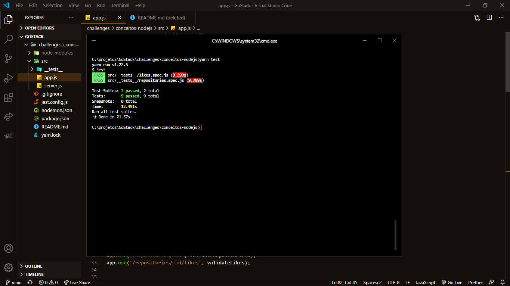

_English_

# Node.js concepts

🚀 About the challenge

In this challenge, I had to create an application to train everything I had learned up to level 01 of Node.js "

The application should store repositories and also allow the creation, listing, updating and removal of the repositories, and also allow the repositories to receive "likes".

`Screenshot of tests`

---

_Português_

# Conceitos do Node.js

🚀 Sobre o desafio

Nesse desafio, eu tinha que criar uma aplicação para treinar tudo o que havia aprendido até o nivel 01 de Node.js"

A aplicação deveria armazenar repositórios e também permitir a criação, listagem, atualização e remoção dos repositórios, e além disso permitir que os repositórios possam receber "likes".

`Captura de tela dos testes`

